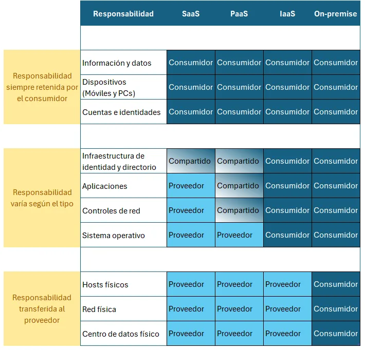
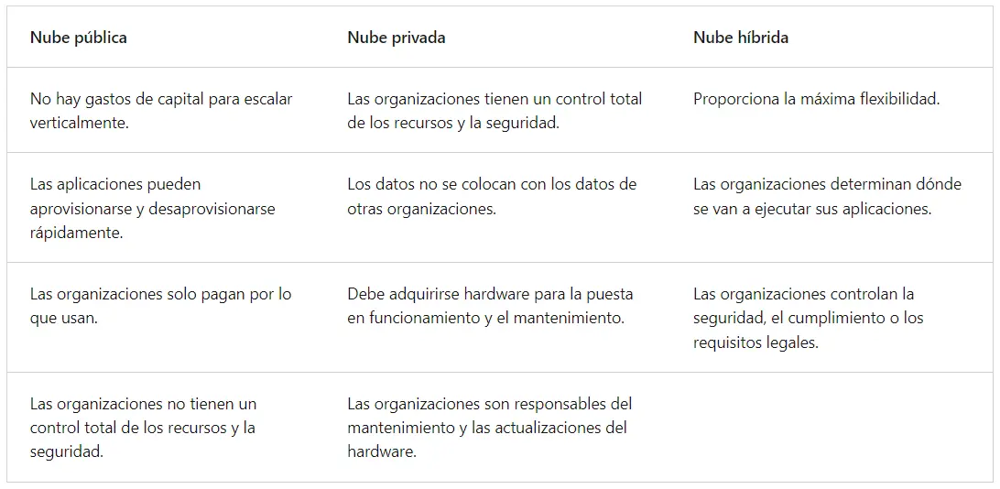

# Informática en la nube:

Es la prestación de servicios informáticos a través de internet. Los más comunes son máquinas virtuales, almacenamiento, bases de datos y redes y muchas más.

**¿Ventajas?**

No hay una limitante con la infraestructura física, es decir, que si necesita aumentar rápidamente la infraestructura de TI, no se tiene que crear o mejorar el centro de datos de la compañía, sino que se puede usar la nube para hacer dicha expansión.

Pero hay más, podemos enumerar unas cuantas ventajas sobre la _informática en la nube_:

- Elección de las características requeridas para la ejecución del software.
- La ubicación el equipo se encuentra en un centro de datos de un proveedor de nube, y no físicamente en la compañía.
- Cada proveedor de nube tiene sus propias ofertas. (La oferta básica es poder de procesamiento y almacenamiento)
- Pago únicamente por las características solicitadas. (Reducción de costos innecesarios)
- Facilidad de escalar los equipos o servicios contratados.
- Las labores de mantenimiento serán delegadas al mismo proveedor.
- Copias de seguridad serán de calidad.
- El software estará en línea de forma ininterrumpida.
- Proyección de un crecimiento rentable para la compañía. (Si el negocio crece, se agregarán recursos escalable y rentable)

## Modelo de responsabilidad Compartida

Para explicar este punto vamos a evocar el **centro de datos corporativo tradicional**, donde la empresa (a partir de este momento llamado "consumidor") es la responsable del espacio físico, la seguridad, el mantenimiento, la infraestructura y el software necesario, (entre otros) para mantener en línea el centro de datos. Es decir, la responsabilidad recae sobre el consumidor.

Con el nuevo modelo, **"responsabilidad compartida"**, estas responsabilidades se comparten entre el proveedor de servicio/nube (a partir de este momento llamado "proveedor") y el consumidor. La seguridad física, la alimentación la refrigeración y la conectividad son responsabilidades del proveedor, teniendo en cuenta que el consumidor no tiene acceso al centro de datos. Al mismo tiempo, el consumidor es responsable de los datos, la información almacenada en la nube y la seguridad (protección incluso sobre el proveedor).

Por ejemplo, si se usa una base de datos SQL en la nube, el proveedor será el responsable de mantener en línea la base de datos, pero es responsabilidad del consumidor los datos que contenga la base de datos.

Dependiendo de los tipos de servicios que se adopten, la responsabilidad será mayor o menor.

## Tipos de servicios en la nube

- Infraestructura como servicio (IaaS - Infrastructure as a Service)
- Plataforma como servicio (PaaS - Platform as a service)
- Software como servicio (SaaS - Software as a Service)

 ![

El consumidor siempre será responsable de:

- La información y los datos almacenados
- Los dispositivos a los que se puede conectarse a la nube
- Cuentas y accesos de los usuarios (Seguridad)

El proveedor en cambio siempre estará encargado de:

- El centro de datos físico
- La red física
- Los hosts físicos

Dependiendo del servicio, se generarán las responsabilidades, en las cuales entrarían como Sistemas Operativos, Controles de Red, Aplicaciones, Infraestructura e Identidad.

## Modelos en la nube por implementación

Cuando hablamos de implementación con respecto a las responsabilidades, se debe hablar de **"Modelos en la nube"**, que definen los tipos de implementación: privados, públicos e híbridos.

**Nube privada** es la implementación que da mucho más control al consumidor, así como más responsabilidades. Se asocia mucho a un centro de datos físico (algunos la consideran la evolución), en el cual, se incrementan costos y disminuyen las ventajas.

**Nube pública** es creada, controlada, administrada y mantenida por un proveedor. Con esta implementación, todo el que quiera comprar estos servicios puede hacerlos, es tan fácil como pagar, acceder a los recursos y usarlos.

**Nube híbrida** es un entorno interconectado entre nubes públicas y privadas. Esta implementación se basa en tener servicios públicos mientras la infraestructura es privada, dándole una capa adicional de seguridad.

## Gastos de consumo

Podemos definir que las estructuras de TI tienen **gastos de capital** y **gastos operativos**.

Los **gastos de capital** generalmente son gastos que se dan por adelantado único para adquirir o proteger los recursos, por ejemplo: Un edificio nuevo, volver a pavimentar el ingreso de las oficinas, crear un centro de datos o comprar un vehículo empresarial.

Los **gastos operativos** son los que se invierten a largo plazo en productos o servicio, por ejemplo: Alquilar un centro de convenciones, alquilar un vehículo empresarial o suscribirse a servicios en la nube.

Teniendo en cuenta lo anterior, la _informática en la nube_ se encuentra en los gastos operativos, y como no se paga en infraestructura física, ni electricidad, ni seguridad ni siquiera mantenimiento, pero a cambio de ellos, se genera un pago por los recursos TI que se usan. Esto con lleva algunas ventajas:

- Sin costes por adelantado.
- No se compran ni administran infraestructuras costosas o sobre potenciado. (Que tiene más capacidad de la necesaria)
- El costo para escalar los servicios son económicos con respecto a la ampliación de un centro de datos más grande.
- Se puede pagar y utilizar en cualquier momento, y, de igual manera, dejar de usar el recurso cuando se desee, lo que también detendrá los pagos.

Podría decirse la _informática en la nube_ evita, pagar de más en cosas que no se usan, mejorar, escalar e incluso disminuir los recursos requeridos para la operación de la compañía.
El pago de "solo lo que se usa", les permite a las compañías:

- Planificar y administrar los costos operativos.
- Ejecutar la infraestructura más eficaz.
- Escalar a media que las condiciones empresariales lo requieran.

> Según el curso de [Microsoft Azure Fundamentals](https://docs.microsoft.com/learn/paths/azure-fundamentals/), la _informática en la nube_ es una forma de alquilar potencia de proceso y almacenamiento de un centro de datos de terceros.

## Conclusión

En este artículo se presentó información sobre los conceptos generales de la nube, como la _informática en la nube_, los modelos de responsabilidad compartida, los modelos de nube y los modelos basado en el consumo y de precio.

Gracias por leer.
