# Signals

Las señales o **'signals'** es un nuevo modelo de reactividad, aunque yo lo llamaré 'concepto', que nace en Solid.js con un concepto llamado _reactividad de grano fino_, y que poco a poco se va extendiendo en el mundo de los frameworks de javascript. Muchos desarrolladores creen que este **concepto** va a cambiar el paradigma del desarrollo web.

### Definición

Podríamos decir que los **signals** son una forma de determinar, como desarrolladores, cómo, cuándo y dónde cambia nuestra aplicación. Los **signals** tienen la habilidad de identificar el nodo específico del DOM para actuar sobre él, evitando así el **re-render** de todo el componente.

### Problemática

Vamos a ver un ejemplo en React, en el cual la funcionalidad es correcta, pero que podría presentar problemas a futuro si la aplicación crece sin prestar atención a este tema.

En este componente tenemos un botón con un texto dinámico que cambiará con cada clic.

```javascript
function App() {
  const [count, setCount] = useState(0);
  console.log("re-render");

  return (
    <>
      <h1>React</h1>
      <div className="card">
        <button onClick={() => setCount((count) => count + 1)}>
          Contador {count}
        </button>
      </div>
    </>
  );
}
```

Tenemos como resultado esto:

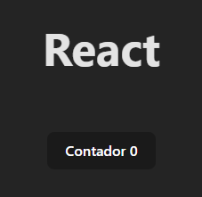

y en la consola tenemos _el seguimiento_:

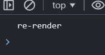

Ahora bien, si queremos hacer un par de clics a nuestro botón, el Hook va a cambiar el valor de la variable `count` a través de su función dispatch `setCount`. React, debido a que está percibiendo un cambio en el estado de la variable, procede a redibujar el componente con la nueva información que tiene, y lo termina haciendo clic por clic.

Entonces, si yo llevo a que la variable `count` llegue al valor de 10, se verá así:

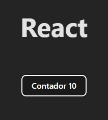

Fácil, cierto, pero como el aumento fue uno a uno, React debió renderizar 10 veces nuestro componente, y la evidencia es esta:

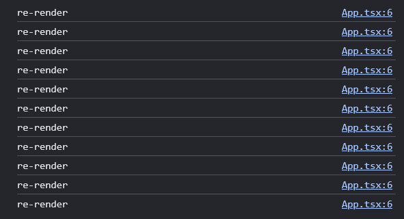

¿Y qué pasa si tenemos un componente hijo?

```javascript
function ChildComponent() {
  console.log("re-render desde el hijo");

  return <span>Dele click al botón!</span>;
}

function App() {
  const [count, setCount] = useState(0);
  console.log("re-render desde el padre");

  return (
    <>
      <h1>React</h1>
      <div className="card">
        <button onClick={() => setCount((count) => count + 1)}>
          Contador {count}
        </button>
      </div>
      <ChildComponent />
    </>
  );
}
```

El resultado será este:

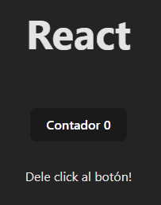

Y, por supuesto, React los renderiza a cada uno. Este es _el seguimiento_:

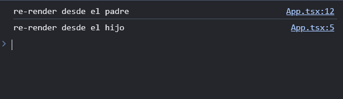

Ahora, ¿Qué pasará al darle varias veces clic al botón? Tener en cuenta que el componente hijo no es dinámico y su naturaleza no requeriría ser nuevamente renderizado.

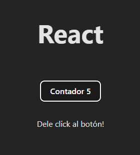

Después de 5 clics, el componente que cambió fue el componente App (mediante el botón se puede ver el cambio), y el hijo se ve igual. Pero, ¿Qué nos dice _el seguimiento_?

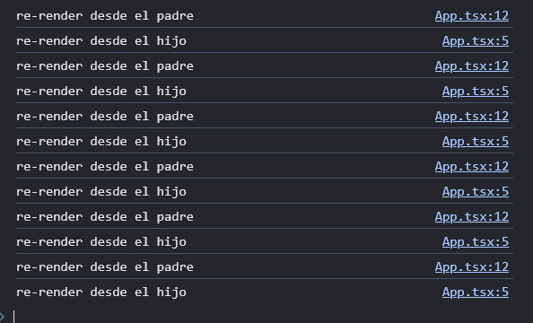

Como vemos, el componente hijo se renderiza igualmente aunque no lo requiera. Pero, ¿y si no quiero que se renderice cada vez que su padre lo haga?

Se puede, React tiene herramientas como el [memo](https://es.react.dev/reference/react/memo).

```javascript
const ChildComponent = memo(() => {
  console.log("re-render desde el hijo");

  return <span>Dele click al botón!</span>;
});
```

_El seguimiento_ sería este:

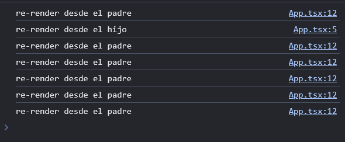

Pero, ¿está bien condicionar al componente hijo por el componente padre? En algunos casos vale la pena, eso dependerá del tipo de componente o proyecto que manejemos.

Ahora bien, es cierto que React nos facilita el render con su DOM virtual, pero ¿es eso suficiente? Si lo vemos con un poco de recelo, podemos intuir que no vale la pena que se renderice todo el componente si solo estoy cambiando un fragmento del mismo. Tener en cuenta que cada render conlleva:

**Consumo de Memoria**

- Creación del Árbol de Elementos
- Estado y Props
- Referencias y Closures

**Procesamiento**

- Reconstrucción del Virtual DOM
- Diferenciación (Diffing)
- Reconciliación
- Re-renderizado de Componentes Hijos

Ahora bien, hay formas de optimizar esta situación, pero para ello debemos implementar otras herramientas, como vimos anteriormente con el 'memo'.

### Solución en SolidJs

SolidJs nos ofrece los [**Signals**](https://docs.solidjs.com/concepts/signals) para mejorar la reactividad de nuestros componentes. El mismo ejercicio con **Signals** sería:

```javascript
function App() {
  const [count, setCount] = createSignal(0);
  console.log("Render");

  return (
    <>
      <h1>Solid</h1>
      <div class="card">
        <button onClick={() => setCount((count) => count + 1)}>
          Contador {count()}
        </button>
      </div>
    </>
  );
}
```

Este es el resultado visualmente:

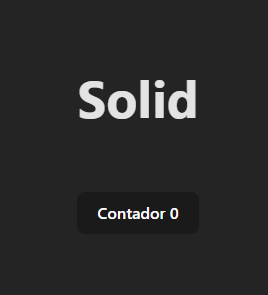

_El seguimiento_ nos indica que se renderizó solo una vez:

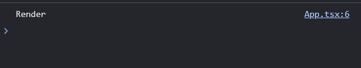

Es similar al ejemplo de React, solo que acá tenemos implementadas las señales. Para crear las señales o **Signals**, debemos usar la función _createSignal_, esta función solicita el valor inicial, recordando que pueden ser desde datos primitivos hasta objetos complejos.

```javascript
import { createSignal } from "solid-js";
const [count, setCount] = createSignal(0);
```

La función _createSignal_ crea una variable reactiva y una función set.

```javascript
const  count: Accessor<number>
const  setCount: Setter<number>
```

Al ser **Accessor**, no tenemos acceso al contenido, en este caso al 'número' `count`, por lo cual, se debe acceder al valor de la misma como si fuese una función: `count()`.

En cuanto al `setCount`, es un **Setter** que llama un callback donde el primer parámetro es el valor de la señal. Aunque por la naturaleza de la señal, `count()` se evalúa para obtener el valor actual del estado, se le suma 1, y el resultado se pasa directamente a `setCount`, la cual asignará el nuevo valor.

```javascript
setCount((count) => count + 1);
setCount(count() + 1);
```

Tener en cuenta que al ser una variable reactiva, todos los cambios en la **señal** harán reaccionar en todo lugar donde se use la misma.

Ahora que tenemos claro cómo se crea una variable, hacemos el mismo ejercicio. 5 clics y el seguimiento indica que solo se renderiza una sola vez:

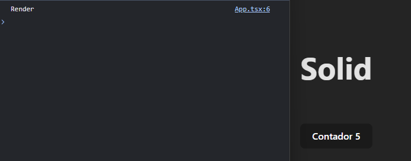

Cambiamos un poco el código para ver en el seguimiento que funcione correctamente el clic del botón.

```javascript
function App() {
  const [count, setCount] = createSignal(0);
  console.log("Render");

  return (
    <>
      <h1>Solid</h1>
      <div class="card">
        <button
          onClick={() =>
            setCount((count) => {
              console.log("Click");
              return count + 1;
            })
          }
        >
          Contador {count()}
        </button>
      </div>
    </>
  );
}
```

Y haciendo 10 clics, el resultado visual es este:

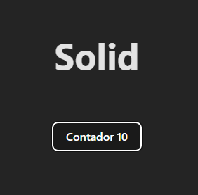

Y el seguimiento nos muestra cada clic realizado sin que el componente se renderice de nuevo por completo.
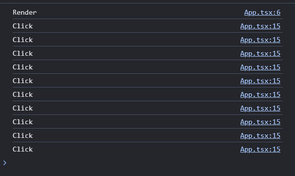

Las señales pueden volverse estados globales porque no necesitan estar dentro del componente que las usa o las modifica.

Ahora pongamos un ejemplo más completo:

- Saquemos la señal de los componentes
- Creemos un componente hijo
- Cambiemos el estado (valor) de la señal
- Miremos cuántos renders se hacen

Este el código:

```javascript
//Fuera de los componentes
const [count, setCount] = createSignal(0);

function ComponenteHijo() {
  console.log("Render desde el hijo");
  // Se renderiza el mensaje, incluida la señal
  return <span>Dele clic a un botón en Solid {count()}</span>;
}

function App() {
  console.log("Render");

  return (
    <>
      <h1>Solid</h1>
      <div class="card">
        <button
          onClick={() =>
            setCount((count) => {
              // Seguimiento para ver los clics
              console.log("Clic desde el padre");
              return count + 1;
            })
          }
        >
          Contador {count()}
        </button>
      </div>
      <ComponenteHijo />
    </>
  );
}
```

Unos clics en el botón, y evidenciamos que a pesar de que la señal está por fuera de los componentes, se puede usar en ambos. Uno en el que se cambia el valor, y el otro es capaz de mostrar el valor.

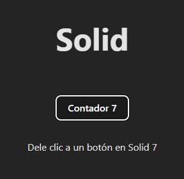

Y _el seguimiento_ nos indica que no se vuelve a renderizar ningún componente.

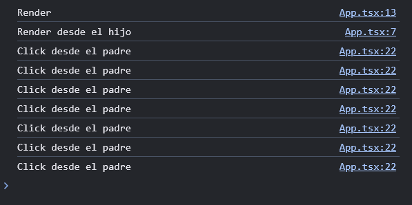

Para hacer un ejemplo un poco más interesante, puse más botones e incluso un intervalo que podía iniciarse y detenerse. La idea es que por más cambios que se le hagan a la señal, no se rendericen componentes que no vienen al caso, o que la misma señal se pueda usar de manera global, fuera de los componentes.

```javascript
const [count, setCount] = createSignal(0);

function ComponenteHijo() {
  console.log("Render desde el hijo");
  return <h1>{count()}</h1>;
}

function App() {
  console.log("Render");

  let conteo: number | undefined;
  const inicio = () => {
    conteo = setInterval(() => {
      setCount(count() + 1);
    }, 1000);
  };
  const fin = () => {
    clearInterval(conteo);
  };

  return (
    <>
      <h1>Solid</h1>
      <div class="card">
        <button onClick={() => setCount(count() + 1)}>Sumar</button>
        <button onClick={() => setCount(count() - 1)}>Restar</button>
        <button onClick={() => setCount(0)}>Reset</button>
      </div>

      <ComponenteHijo />

      <div class="card">
        <button onClick={inicio}>Inicio</button>
        <button onClick={fin}>Detener</button>
      </div>
    </>
  );
}
```

La _signal_ sigue cambiando, a pesar de tantos cambios...

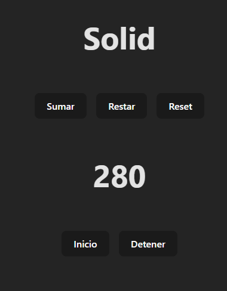

Y _el seguimiento_, nos indica que no se vuelve a renderizar ningún componente, como lo ha hecho desde que usamos las señales.

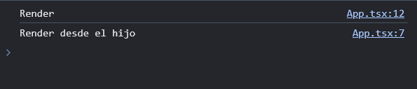

Con esto, hemos visto la implementación básica de las **signals**.

### Desventajas de las Signals

Aunque las **signals** ofrecen varias ventajas en términos de eficiencia y rendimiento, también presentan ciertos desafíos que serán importantes para que los tengamos en cuenta. Primero, la curva de aprendizaje puede ser bastante pronunciada, especialmente para desarrolladores acostumbrados a métodos tradicionales de reactividad y manejo del estado. Además, la compatibilidad con herramientas y librerías puede ser limitada, lo que podría exigir soluciones alternativas o ajustes adicionales. (Al día que escribo esto, React no cuenta con **signals**).

Otra dificultad es la gestión global de estados, que puede volverse más compleja en aplicaciones grandes, complicando la comunicación entre diferentes partes de las aplicaciones. Aunque las **signals** suelen mejorar el rendimiento, en escenarios específicos con alta complejidad reactiva, los beneficios pueden no ser tan evidentes e incluso podrían surgir nuevos problemas de rendimiento.

El ecosistema y el soporte comunitario alrededor de las **signals** aún están en desarrollo, lo que puede significar menos recursos y ejemplos para resolver problemas. Y algo a tener en cuenta es que integrar **signals** en sistemas con 'enfoques' o patrones de diseño existentes, puede demandar una refactorización significativa que implicará costos y mano de obra.

### Conclusión

Las señales **signals** representan una poderosa herramienta para optimizar el rendimiento de nuestras aplicaciones web. Al permitirnos controlar de manera precisa cuándo y dónde se deben actualizar los componentes, podemos reducir significativamente la cantidad de renderizados innecesarios. Esto no solo mejora la eficiencia, sino que también proporciona una experiencia de usuario más fluida y rápida.

A medida que más frameworks empiecen a usar este 'concepto'', es probable que veamos cambios en cómo se hace el desarrollo web, más detallado y eficiente en el manejo de los estados. Aunque React y otros frameworks ya tienen sus propias formas de optimizar, las señales o **signals**, ofrecen una alternativa interesante que podría ser útil explorar. Definitivamente es un **nuevo modelo de reactividad** que puede cambiar ciertas formas de pensar y de desarrollar en el frontend.

Gracias por leer.
