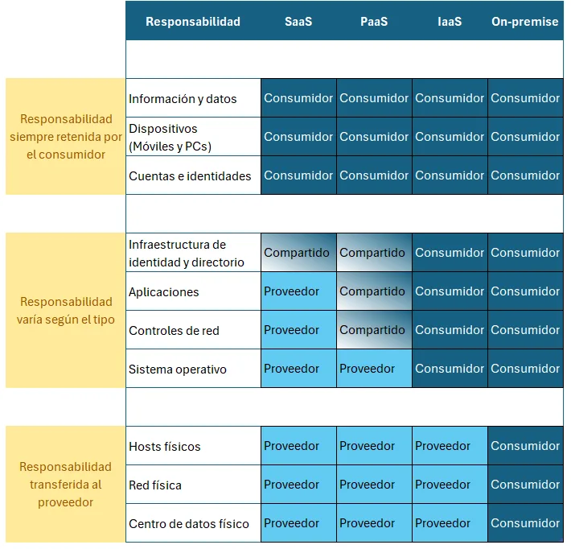
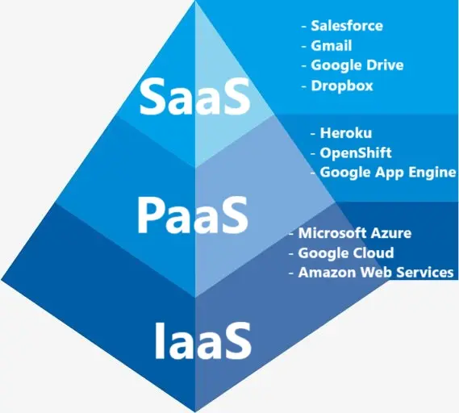

# Tipos de Servicios en la nube

Los tipos de servicio en la nube determinan la flexibilidad a la hora de administrar y configurar recursos. Cada uno tiene implementado un "modelo de responsabilidad compartida".

### Actualmente tenemos 3 tipos:

- Infraestructura como servicio **(IaaS)**.
- Plataforma como servicio **(Paas)**.
- Software como servicio **(SaaS)**.

## IaaS

La infraestructura como servicio, es el servicio en la nube más flexible, debido a que permite tener el máximo control de los recursos solicitado, esto debido a que el proveedor solo se encarga de mantener el hardware, la conectividad de red y la seguridad física. Esto hace que sea el "Cliente" tenga el resto de responsabilidades (instalación, configuración y mantenimiento del sistema operativo, configuraciones de red, base de datos y storages de almacenamientos, entre otros). Este enfoque va muy orientado al "Alquiler de hardware", esto permite tener control el software y olvidarse de tener un espacio en la "empresa".

### Ejemplos:

- Microsoft Azure
- Amazon Web Services
- Google Cloud
- Stackscale
- VMware
- OVH
- OpenStack

## PaaS

La plataforma como servicio, es el punto intermedio entre el alquiler de hardware y el alquiler de software.
Mientras el proveedor se encarga de la estructura física, la seguridad, la conexión a internet, la administración de sistemas operativos, los middlewares, herramientas de desarrollo y los servicios de inteligencia empresarial ( analíticas, informes, procesamiento de eventos, gestión de rendimientos, etc), eso deja que el "Cliente" solo se enfoque generar un ambiente de desarrollo de su negocio. Es beneficioso si se quiere manejar un estándar general y se quiere trabajar evitando la infraestructura, licencias y aplicaciones complementarias.

### Ejemplos:

- Heroku
- Google App Engine
- OpenShift
- Apache Stratos
- Flynn
- Cloud Foundry

## SaaS

El software como servicio, es el enfoque que se ve como un producto. Se puede considerar como alquilar o usar una aplicación totalmente desarrollada. Aunque su enfoque es poco flexible, podemos decir que es el más sencillo a la hora de utilizarse debido a que no requiere conocimientos técnicos o experiencia para ser usado. Los correos electrónicos y los software especializados, son un ejemplo de esto. La responsabilidad del "Cliente" tendrá únicamente responsabilidad con los datos, los dispositivos y usuarios que se conectarán con él. El resto, como la infraestructura y aplicaciones complementarias, hardware y software base, serán responsabilidad del proveedor.

### Ejemplos:

- Acumbamail
- Salesforce
- Gmail
- Google Drive
- Dropbox
- Slack
- Trello
- GoToMeeting

### Responsabilidades compartidas

En esta imagen podemos ver las responsabilidades de cada uno de los servicios:

### Tipos de Nube por Implementación

En este gráfico podemos ver ejemplos de los servicios que se pueden implementar en la nube.

(imagen)

## Conclusión

Los servicios en la nube permiten a las empresas elegir el nivel de control y responsabilidad que desean asumir, dependiendo de sus necesidades. Desde la flexibilidad total de IaaS, pasando por la facilidad para desarrollar de PaaS, hasta la simplicidad de SaaS, estos modelos ofrecen soluciones adaptables para diferentes casos de uso en la era digital.

Gracias por leer.
