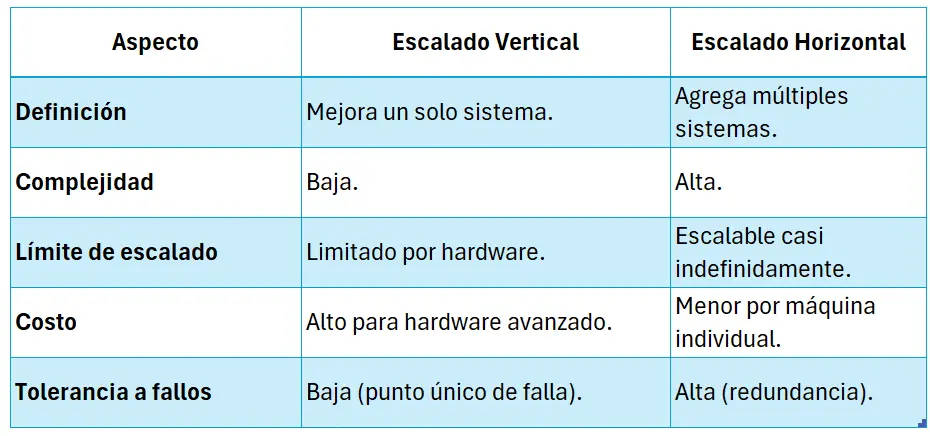
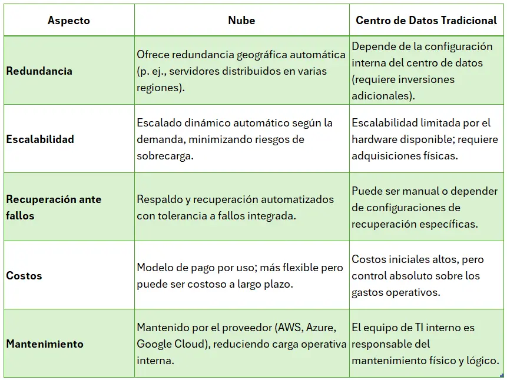
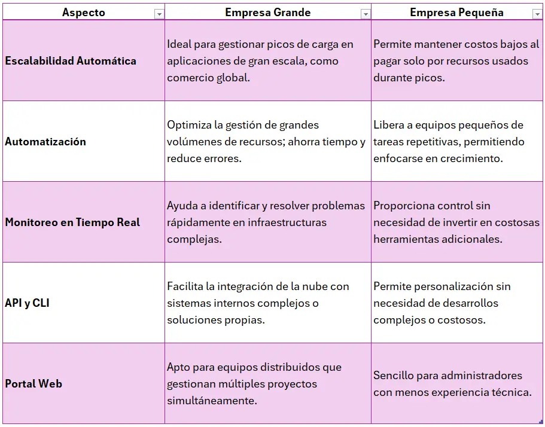
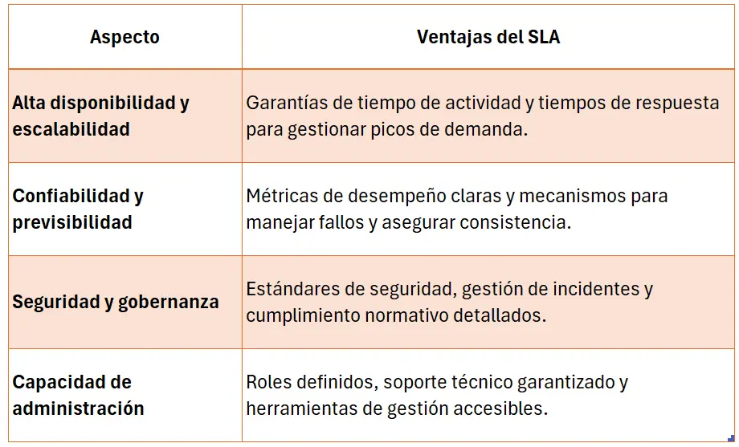

# Ventajas de la nube

Teniendo en cuenta que entendemos el enfoque de la informática en la nube, veremos ahora las ventajas que ofrece.

## Alta disponibilidad

La **alta disponibilidad** es un enfoque y diseño de sistemas que busca garantizar que un servicio o sistema **esté operativo y accesible la mayor parte del tiempo**, minimizando los periodos de inactividad. Esto se logra mediante redundancia, tolerancia a fallos, y mecanismos automáticos de recuperación ante errores.

En términos generales, un sistema de alta disponibilidad tiene el objetivo de asegurar una disponibilidad continua, incluso ante fallos de hardware, software, o fallos imprevistos en la red. La disponibilidad generalmente se mide como un porcentaje, por ejemplo, 99.9% o "tres nueves" (lo que equivale a 8.76 horas de inactividad al año), si se tiene servicio en línea utilizado por millones de usuarios en todo el mundo.

Para garantizar alta disponibilidad, este servicio debe implementar:

- **Balanceadores de carga**: Distribuyen las solicitudes de los usuarios entre múltiples servidores para evitar la sobrecarga de alguno y asegurar una operación continua.
- **Redundancia geográfica**: Los servidores están ubicados en múltiples centros de datos (o regiones en la nube) para asegurar que si un centro de datos falla (por ejemplo, por un corte eléctrico o desastre natural), otro pueda tomar el control inmediatamente.
- **Bases de datos replicadas**: La base de datos utilizada para almacenar transacciones debe tener réplicas en tiempo real para evitar pérdida de datos y permitir la continuidad del servicio.
- **Automatización y monitoreo**: Sistemas de monitoreo detectan fallos o problemas en tiempo real y desencadenan mecanismos de recuperación automática, como el reinicio de servicios o el enrutamiento del tráfico a servidores saludables.

 
    Si un usuario realiza un pago y el servidor primario encargado de procesarlo falla, un sistema de alta disponibilidad redirigiría automáticamente esa solicitud a un servidor secundario o en otra región, sin que el usuario perciba el problema.

    El papel de la informática en la nube frente al centro de datos convencional

    - **Escalabilidad dinámica**:
      En un centro de datos convencional, añadir capacidad para manejar más carga puede requerir la compra e instalación de servidores físicos, lo que lleva tiempo y altos costos iniciales.
      En la nube, los recursos se escalan automáticamente según la demanda (escalado horizontal o vertical), lo que facilita la implementación de alta disponibilidad.
    - **Redundancia global accesible**:
      Los servicios en la nube (Azure) permiten implementar alta disponibilidad utilizando múltiples regiones y zonas de disponibilidad sin la necesidad de construir y mantener centros de datos en diversas ubicaciones.
    - **Mantenimiento reducido y recuperación automatizada**:
      En un centro de datos convencional, el equipo técnico debe responder físicamente a fallos o problemas en el hardware. En la nube, los proveedores ofrecen mecanismos integrados para detectar y solucionar problemas automáticamente, como restauraciones rápidas de máquinas virtuales o servicios gestionados que son resilientes por diseño.
    - **Costos más eficientes**:
      La nube funciona bajo un modelo de pago por uso. En vez de mantener infraestructura en espera para manejar posibles fallos (como ocurre en los centros de datos tradicionales), los sistemas en la nube pueden aprovisionar o reducir recursos de manera eficiente según las necesidades.

  

## Escalabilidad

Podemos referir como la capacidad de **ajustar los recursos para satisfacer la demanda**, a la escalabilidad, por ejemplo si se tiene un tráfico máximo y los sistemas están sobrecargados, la capacidad de escalar implica agregar más recursos para controlar de la mejor manera dicha demanda.

Como la informática de la nube tiene como regla, **"solo pagar por lo que se usa"**, entonces el sobre costo solo se verá reflejado en el momento de tráfico máximo, por lo cual, si la demanda es baja, se reduciría los recursos usados y, por lo mismo, se reducirían los costos.

### Vertical y Horizontal.

El escalado vertical y el escalado horizontal son estrategias utilizadas para aumentar la potencia de procesamiento o almacenamiento de una infraestructura.

#### Escalado Vertical (Vertical Scaling)

Consiste en aumentar los recursos de un solo servidor o máquina para mejorar su capacidad. Esto puede incluir agregar más memoria RAM, un procesador más rápido, más núcleos de CPU, o mayor capacidad de almacenamiento a un único sistema.

Se puede destacar en esta estrategia:

- **Simplicidad**: Es más fácil de implementar porque no requiere modificar el software para manejar múltiples máquinas.
- **Mantenimiento**: Un único sistema centralizado es más fácil de administrar.

Sin embargo:

- **Límite físico**: Hay un límite de cuánto puedes mejorar una máquina.
- **Costo**: Los equipos con componentes más avanzados son significativamente más caros.

#### Escalado Horizontal (Horizontal Scaling)

Consiste en agregar más máquinas (nodos) al sistema para distribuir la carga de trabajo. Esto crea un sistema distribuido donde varias máquinas trabajan juntas para manejar el aumento de demanda.

¿Qué Ventajas vemos en esta estrategia?:

- **Escalabilidad infinita**: Puedes agregar tantas máquinas como sea necesario.
- **Redundancia**: Si un nodo falla, los demás siguen funcionando, mejorando la tolerancia a fallos.

Pero ¿tendrá desventajas?

- **Complejidad**: Requiere ajustar la arquitectura del software para trabajar en un entorno distribuido.
- **Mantenimiento**: Más máquinas significan mayor esfuerzo de administración.

 
  Supongamos que se tiene un servidor que aloja una aplicación web que recibe un gran incremento en el tráfico durante la temporada navideña, tanto el escalado vertical como el escalado horizontal son opciones viables, pero cada una tiene implicaciones diferentes. Además, la informática en la nube puede ofrecer soluciones específicas que faciliten la implementación de ambos enfoques.
  
  El escalado vertical implica mejorar un servidor existente con hardware más potente, como añadir más RAM, un procesador más rápido o discos SSD más veloces. También requiere optimizar el sistema operativo y la base de datos para aprovechar los nuevos recursos. Es una solución rápida y sencilla, ideal si la aplicación no está diseñada para funcionar en múltiples servidores. Sin embargo, tiene límites físicos y, si el servidor falla, toda la aplicación queda inoperativa.
  
  Por otro lado, el escalado horizontal consiste en agregar más servidores para distribuir la carga. Esto se logra mediante un balanceador de carga y la configuración adecuada para que los servidores trabajen de manera coordinada, compartiendo recursos o replicando bases de datos. Aunque ofrece mejor escalabilidad y tolerancia a fallos a largo plazo, requiere ajustar la arquitectura de la aplicación y gestionar una infraestructura más compleja.
  
  La mejor solución depende del contexto:
  
  Si se necesita una solución simple y de corto plazo: **Escalado vertical**, pero si se busca flexibilidad, tolerancia a fallos y escalabilidad sostenible: **Escalado horizontal**. La informática en la nube es particularmente útil porque simplifica ambos enfoques, reduce costos iniciales y ofrece herramientas avanzadas como autoescalado y balanceadores de carga.

## Confiabilidad

La confiabilidad se refiere a **la capacidad de un sistema para operar continuamente sin fallos** durante un periodo de tiempo determinado. Incluye aspectos como alta disponibilidad, recuperación ante fallos, redundancia, y resiliencia ante desastres. Es clave en servicios críticos, como las transacciones bancarias, donde las fallas pueden tener consecuencias graves tanto económicas como reputacionales.

Si un banco permite a sus clientes realizar pagos en línea. La confiabilidad se da a través de:

- **Alta disponibilidad**: El servidor que procesa pagos debe estar disponible casi siempre (p. ej., 99.999% del tiempo, conocido como "cinco nueves"). Esto significa que solo puede estar inactivo unos pocos minutos al año.
- **Redundancia**: Si el servidor principal falla, un servidor secundario (replicado en tiempo real) asume el trabajo inmediatamente para evitar interrupciones.
- **Recuperación ante desastres**: Si ocurre un desastre en un centro de datos principal (incendio, corte de energía), los servidores en una ubicación secundaria deben estar listos para tomar el control y garantizar que las transacciones puedan continuar sin pérdida de datos.

En ese orden de ideas, si un cliente hace un pago de $100 a través de una aplicación bancaria y el servidor principal está sobrecargado o falla justo después de autorizar el débito pero antes de confirmar la transacción, el sistema confiable:

- Detecta el fallo.
- Reenviar la operación al servidor secundario.
- Confirmar al cliente la transacción exitosa sin duplicar cargos ni generar inconsistencias.

## Previsibilidad

La previsibilidad se refiere a **la capacidad de anticipar el comportamiento, rendimiento y disponibilidad de un sistema** bajo diferentes condiciones. Esto incluye garantizar que las operaciones sean consistentes, con tiempos de respuesta y desempeños esperados, sin variaciones significativas debido a picos de demanda, errores o fallos.

  Si se tiene una base de datos que gestiona registros de usuarios en un sistema de comercio electrónico. Durante el día del "Black Friday", el tráfico aumenta exponencialmente, con miles de consultas por segundo para verificar inventarios y procesar pedidos.
  
  Si el sistema no está diseñado para ser predecible, podría experimentar lentitud, errores de consulta o incluso caídas durante los picos de demanda. Los tiempos de respuesta se volverían erráticos, afectando la experiencia del usuario y provocando pérdida de ventas.
  
  Pero si el sistema se diseña para ser predecible, se mantienen los tiempos de respuesta consistentes (por ejemplo, menos de 200 ms por consulta), incluso durante la alta demanda, se escala automáticamente para manejar el tráfico adicional, evitando cuellos de botella y se garantiza la integridad y consistencia de los datos, sin riesgo de fallos durante las operaciones críticas.

Las ventajas en la previsibilidad en la nube:

- **Escalado Automático y Dinámico**: Los servicios en la nube pueden anticipar variaciones de carga y ajustar automáticamente los recursos asignados para mantener el rendimiento uniforme.
- **Monitoreo Continuo y Optimización Proactiva**: Las plataformas en la nube incluyen herramientas avanzadas de monitoreo que detectan problemas potenciales y los resuelven antes de que impacten al usuario, garantizando operaciones consistentes.
- **Alta Disponibilidad Integrada**: Gracias a la distribución global y la redundancia, los servicios en la nube aseguran un acceso continuo a los datos sin interrupciones, incluso ante picos imprevistos de demanda o fallos en componentes individuales.

## Gobernanza

La gobernanza implica establecer políticas, normas y controles para garantizar que los recursos en la nube operen de manera alineada con los objetivos organizacionales y regulaciones externas.

Ventajas:

- **Cumplimiento Normativo Automatizado**: Las plantillas de conjunto (infrastructural templates) permiten implementar recursos que cumplen automáticamente con estándares predefinidos, como ISO, PCI-DSS, o GDPR.
- **Actualización Dinámica de Políticas**: Es posible actualizar configuraciones y políticas en todos los recursos de manera centralizada, asegurando que siempre cumplan con las normativas vigentes.
- **Auditoría en Tiempo Real**: La nube ofrece herramientas para identificar y marcar recursos que no cumplan con los estándares corporativos. Esto permite tomar acciones correctivas rápidas y minimizar riesgos.
- **Automatización de Cambios**: Las revisiones de software y actualizaciones pueden aplicarse de forma automática en muchos modelos (SaaS y PaaS), lo que asegura que los sistemas estén siempre al día.

Sí una organización financiera puede usar herramientas como Azure Policy para garantizar que todos sus servidores estén configurados correctamente y cumplan con los requisitos regulatorios, marcando y solucionando automáticamente configuraciones inseguras.

## Seguridad

La seguridad aborda la protección contra amenazas externas e internas, ofreciendo flexibilidad para adaptarse a diferentes niveles de control.

Ventajas:

- **Opciones Flexibles de Control**: Dependiendo del modelo (IaaS, PaaS o SaaS), las empresas pueden decidir cuánta responsabilidad desean asumir sobre la seguridad:
  - **IaaS**: Ofrece control granular sobre el hardware, sistemas operativos y aplicaciones, ideal para empresas con necesidades específicas de seguridad.
  - **PaaS y SaaS**: Automatizan el mantenimiento, revisiones y seguridad básica, liberando a las organizaciones de tareas operativas.
- **Protección contra Ataques DDoS**: Los proveedores de nube incluyen sistemas robustos de mitigación de ataques DDoS, garantizando alta disponibilidad y estabilidad de la red.
- **Seguridad Perimetral y Datos Encriptados**: Las soluciones en la nube suelen ofrecer cifrado de datos en tránsito y en reposo, firewalls virtuales y detección de intrusiones integrada.
- **Revisiones y Actualizaciones Automatizadas**: Mantener los sistemas actualizados reduce significativamente los riesgos de vulnerabilidades explotables.

Si una empresa de comercio electrónico usa servicios como Azure Security Center, entonces puede monitorear amenazas, aplicar parches automáticamente y protegerse contra ataques en tiempo real.

## Capacidad de Administración

La administración ofrece **herramientas y características diseñadas para simplificar la gestión y supervisión** de los recursos alojados en la nube. Estas capacidades se dividen en dos áreas principales:

### Administración de la nube:

Se enfoca en gestionar los recursos implementados dentro de la nube. Esto incluye características como escalabilidad automática basada en la demanda, implementación de recursos mediante plantillas preconfiguradas, supervisión en tiempo real, y la capacidad de reemplazar automáticamente recursos defectuosos. También proporciona alertas automáticas basadas en métricas para mantener informado al usuario sobre el estado y rendimiento del sistema.

### Administración en la nube:

Se refiere a las formas en las que se pueden gestionar los recursos y el entorno en la nube. Esto incluye opciones como el uso de portales web intuitivos, herramientas de línea de comandos, interfaces de programación de aplicaciones (APIs), y scripts avanzados como PowerShell para automatizar tareas y flujos de trabajo.

### Características clave de Administración:

- **Escalabilidad automática**: Permite ajustar los recursos (cómputo, almacenamiento, etc.) según la demanda en tiempo real, asegurando un uso eficiente y reducción de costos.
- **Implementaciones consistentes**: Las plantillas preconfiguradas eliminan errores manuales, aceleran el tiempo de despliegue y aseguran que los recursos cumplan con estándares organizacionales.
- _Monitoreo y alertas en tiempo real_: Los sistemas de monitoreo proporcionan visibilidad del rendimiento, mientras que las alertas ayudan a mitigar problemas antes de que impacten las operaciones.

El proveedor brinda generalmente unas opciones de Gestión:

- _Portal web_: Fácil de usar, accesible desde cualquier navegador, ideal para tareas visuales y administrativas rápidas.
- **Línea de comandos (CLI)**: Herramienta poderosa para usuarios avanzados, útil para automatización y administración remota.
- **APIs**: Facilitan la integración de recursos de la nube con aplicaciones internas, lo que permite personalización avanzada.
- **PowerShell**: Herramienta de scripting flexible que permite gestionar recursos en la nube a gran escala con comandos personalizables.

> Veamos dos ejemplos en empresas de diferente tamaño
>
> Una **“multinacional”** que gestiona aplicaciones en múltiples regiones puede usar la escalabilidad automática para manejar aumentos de tráfico, como el lanzamiento global de un nuevo producto. Las APIs integran recursos en la nube con sistemas existentes, como CRMs o ERPs, mientras que las métricas y alertas mantienen a los equipos al tanto del rendimiento.
>
> Una **“startup de comercio electrónico”**, puede usar plantillas preconfiguradas para lanzar su infraestructura en minutos, evitando gastos en personal técnico especializado. La escalabilidad automática le permite responder a picos durante eventos de marketing sin costos innecesarios en momentos de baja demanda.

La capacidad de administración en la nube democratiza el acceso a herramientas avanzadas, adaptándose tanto a las necesidades de empresas grandes como pequeñas. Para las grandes, ofrece flexibilidad, automatización masiva y soporte para entornos complejos; para las pequeñas, facilita un uso eficiente de recursos con mínimos costos operativos. Es una solución versátil que mejora la gestión de TI en cualquier escala.

## SLA (Service Level Agreement)

SLA o Acuerdo de Nivel de Servicio, es un **contrato o acuerdo formal entre un proveedor de servicios y un cliente** que define los niveles de calidad, disponibilidad y responsabilidad que el servicio debe cumplir.

Un SLA generalmente incluye los siguientes puntos:

- **Definición del servicio**: Descripción detallada de los servicios que se están proporcionando.
- **Niveles de disponibilidad y rendimiento esperados**: Por ejemplo, garantizar una disponibilidad del 99.9% o definir tiempos máximos de respuesta para solicitudes o incidentes.
- **Métricas de desempeño**: Cómo se mide el rendimiento del servicio, como tiempo promedio de resolución de problemas o latencia máxima permitida para un servicio.
- **Roles y responsabilidades**: Detalles de las responsabilidades tanto del proveedor como del cliente. Por ejemplo, el cliente debe notificar problemas específicos para que el proveedor pueda intervenir.
- **Gestión de incidencias y tiempos de respuesta**: Protocolo para resolver problemas o fallos, junto con el tiempo máximo aceptado para resolverlos (como 4 horas para problemas críticos).
- **Penalizaciones**: En caso de que el proveedor no cumpla con los niveles prometidos, se definen compensaciones, como descuentos en facturas o créditos para el cliente.

Un SLA bien diseñado asegura que el cliente obtenga un servicio **confiable, seguro y escalable**, mientras proporciona mecanismos claros para evaluar y administrar su desempeño.

## Conclusión:

La informática en la nube ofrece una combinación de **ventajas que transforman la manera en que las organizaciones operan**, gestionan y escalan sus recursos tecnológicos. Su escalabilidad dinámica y modelo de pago por uso la convierten en una solución económica y adaptable a empresas de todos los tamaños, permitiéndoles operar con mayor eficiencia y minimizar riesgos. Además, la capacidad de implementar alta disponibilidad, redundancia global y recuperación automatizada fortalece la continuidad operativa. Respaldada por SLA claros, la nube se posiciona como una opción estratégica para organizaciones que buscan optimizar su infraestructura tecnológica, fomentar la innovación y garantizar un servicio de calidad en un entorno empresarial cada vez más competitivo.

Gracias por leer
